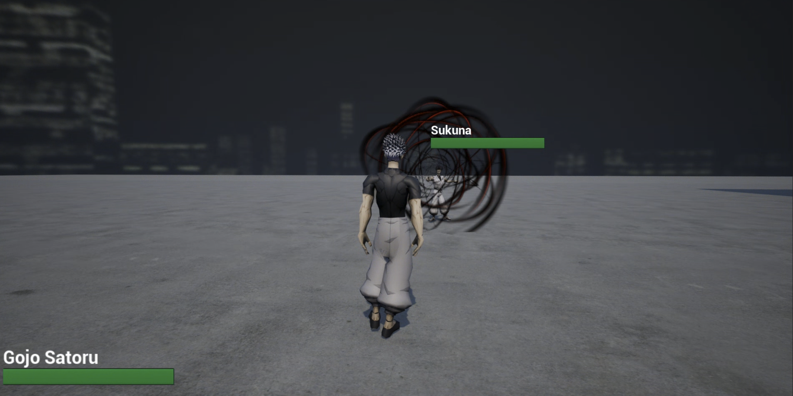

# 👻 Jujutsu Kaisen 3D 액션 게임

## 🎮 게임 장르

3D PvP 전투 액션 게임

## 📖 게임 소개

[프로젝트 영상 보기](https://www.youtube.com/watch?v=Ayzv4Kz-ZpE) 

스팀 3D 액션 대전 게임 『주술회전 전화향명』을 기반으로 한 모작 학습 프로젝트입니다.
언리얼 엔진 5와 C++을 활용해 전투 시스템의 구조와 구현 방식을 분석하며
특히 스킬 시스템과 액션 전투 로직을 중심으로 모작 및 개선을 진행하고 있습니다.

플레이어는 주술회전의 다양한 캐릭터 중 하나를 선택해 AI 또는 멀티플레이 전투를 즐길 수 있도록 개발 중이며,
모작을 통해 원작의 전투 감각을 재현하는 동시에, 독자적인 조작 방식과 신규 스킬 이펙트를 접목하는 것을 목표로 하고 있습니다.

> 📅 제작 기간: 2025.08 ~ 진행중!!!💪
> 

---

## 🧰 기술 스택

- **게임 엔진:** Unreal Engine 5.5
- **개발 IDE:** Visual Studio 2022
- **3D 모델링 및 리소스:**
    - Unreal Engine 기본 에셋
    - Mixamo 무료 에셋
    - CGTrader, sketchfab 에서 일부 모델 구매 (📌 *비상업용 개인 프로젝트용*)
- **버전 관리:** GitHub (GitHub Desktop 사용)

---

# 📌 주요 기능 정리 (Jujutsu Kaisen Combat System)

## 1. HSFM 기반 캐릭터 상태 관리
- 다양한 피격 상태를 체계적으로 관리하기 위해 **HSFM(Hierarchical State Machine)** 구조 사용  
- AnimInstance는 **옵저버 패턴**으로 상태를 감지하여 시퀀스/몽타주 재생을 분리 처리  

### 상태 enum 정의
```cpp
UENUM(BlueprintType)
enum class ECharacterState : uint8
{
	Locomotion = 0,     // 로코모션
	Falling = 1,        // 낙하
	Skill = 2,          // 스킬 사용
	Hit = 3             // 피격
};

UENUM(BlueprintType)
enum class EHitSubState : uint8
{
	Custom = 0,
	Stun = 1,
	Light = 2,
	KnockBack = 3
};
```

---

## 2. 스킬 매니저 기반 스킬 관리  
- 모든 캐릭터는 공통 컴포넌트로 **SkillManager 객체를 소유**  
- 스킬은 SkillManager 내부 TMap에 등록  
- 캐릭터 입력 → SkillManager에 위임  
- 스킬 로직은 스킬 클래스 내부에서만 담당  

### 캐릭터 입력 처리 예시
```cpp
void AJujutsuKaisenCharacter::R_Pressed()
{
	if (IsOtherSkillInUse(ESkillIndex::R))
	{
		return;
	}

	SetSkillInUse(ESkillIndex::R, true);
	
	if (StateManager && StateManager->SetState(ECharacterState::Skill))
	{
		if (SkillManager)
		{
			SkillManager->HandlePressed("R");
		}
	}
}
```

### SkillManager 처리 예시
```cpp
void USkillManager::HandlePressed(FName Key)
{
    if (auto* Skill = BoundSkills.FindRef(Key))
    {
        Skill->OnPressed();
    }
}
```

---

## 3. 커스텀 발사체 이동 컴포넌트 제작  
언리얼 기본 `UProjectileMovementComponent`는 충돌 시 멈추므로  
**Rush 타입 스킬을 구현할 수 없어 직접 커스텀 구현.**

### 충돌 처리 override
```cpp
UCustomProjectileMovement::EHandleBlockingHitResult 
UCustomProjectileMovement::HandleBlockingHit(
    const FHitResult& Hit, 
    float TimeTick, 
    const FVector& MoveDelta, 
    float& SubTickTimeRemaining)
{
	switch (MoveType)
	{
	case EProjectileMoveType::Single:
		return Super::HandleBlockingHit(Hit, TimeTick, MoveDelta, SubTickTimeRemaining);
		
	case EProjectileMoveType::Rush:
	{
		if (GetOwner())
		{
			float CurrentSpeed = Velocity.Size();
			Velocity = GetOwner()->GetActorForwardVector() * CurrentSpeed;
			ProjectileGravityScale = 0.0f;
		}
		
		return EHandleBlockingHitResult::AdvanceNextSubstep;
	}
	}

	return Super::HandleBlockingHit(Hit, TimeTick, MoveDelta, SubTickTimeRemaining);
}
```

---

## 4. 커스텀 카메라 매니저  
카메라 액션, 시네마틱, 타겟 추적을 하나의 클래스로 통합 관리하기 위해  
**CustomCameraManager** 제작.

### 타겟 포커스 시점 유지 예시
```cpp
void ACustomCameraManager::UpdateViewTarget(FTViewTarget& OutVT, float DeltaTime)
{
	Super::UpdateViewTarget(OutVT, DeltaTime);

	if (CachedCharacter.IsValid())
	{
		UpdateCameraForCharacter(CachedCharacter.Get(), DeltaTime);
		return;
	}

	if (!PCOwner)
	{
		return;
	}

	APawn* ControlledPawn = PCOwner->GetPawn();
	AJujutsuKaisenCharacter* ControlledCharacter = Cast<AJujutsuKaisenCharacter>(ControlledPawn);

	if (!ControlledCharacter)
	{
		CachedCharacter.Reset();
		return;
	}

	CachedCharacter = ControlledCharacter;
	UpdateCameraForCharacter(ControlledCharacter, DeltaTime);
}
```

---
