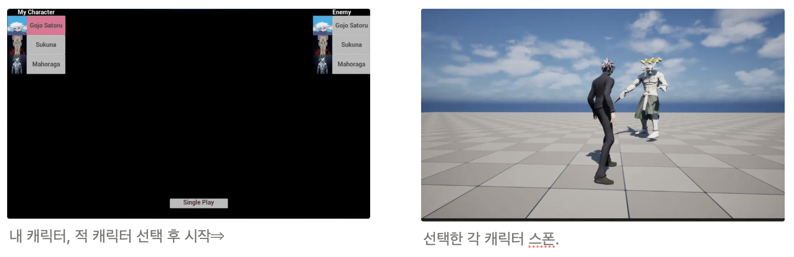
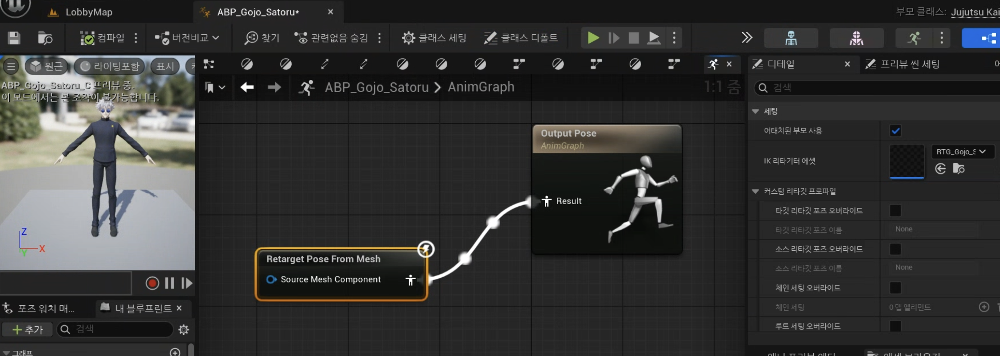

# 👻 Jujutsu Kaisen 3D PvP 액션 게임

## 🎮 게임 장르

3D PvP 전투 액션 게임

## 📖 게임 소개


이 게임은 인기 애니메이션 주술회전(Jujutsu Kaisen) 을 기반으로 한 3D PvP 액션 게임입니다.
플레이어는 주술회전에 등장하는 다양한 캐릭터들 중 하나를 선택하여 AI 또는 친구와 멀티플레이 전투를 즐길 수 있습니다.

게임 시스템은 스팀 게임 『주술회전 전화향명』 을 참고하여 제작 중이며
완전히 모작이 아닌, 독자적인 창의 요소와 조작 방식을 접목하여 색다른 전투 경험을 제공하는 것을 목표로 합니다.

개발자 본인은 특히 고조 사토루 캐릭터에 깊은 애정을 가지고 있으며 애니메이션의 전개에서 벗어나
자신만의 상상력을 담은 전투와 시나리오를 구현하고자 이 프로젝트를 시작했습니다.
최종 목표는 고조 사토루의 모든 기술을 직접 구현하고 진정한 “최강”의 플레이를 실현하는 것입니다.

> 📅 제작 기간: 2025.05.07 ~ 진행중!!!💪
> 

---

## 🧰 기술 스택

- **게임 엔진:** Unreal Engine 5.5
- **개발 IDE:** Visual Studio 2022
- **3D 모델링 및 리소스:**
    - Unreal Engine 기본 에셋
    - Mixamo 무료 에셋
    - CGTrader, sketchfab 에서 일부 모델 구매 (📌 *비상업용 개인 프로젝트용*)
- **버전 관리:** GitHub (GitHub Desktop 사용)

---

## 🧩 주요 기능

## 1. 캐릭터 선택 및 동적 생성 시스템


플레이어 캐릭터와 적 AI 캐릭터를 **선택에 따라 동적으로 로딩**하는 시스템을 구현했습니다.

- 사용자가 로비 화면에서 캐릭터를 선택하면, 해당 캐릭터에 대한 `DataAsset` 정보가 `GameInstance`의 멤버 변수에 저장됩니다.
- 이후 **`Single Play` 버튼**을 누르면, `SinglePlayGameMode` 클래스가 `GameInstance`에 저장된 정보를 참조하여, 각각의 캐릭터를 동적으로 로드 및 스폰합니다.

### 🎮 캐릭터 클래스 구조

모든 캐릭터는 **공통 부모 클래스인 `JujutsuKaisenCharacter`** 를 상속받아 제작되었습니다. 이를 통해 공통 기능(이동, 공격 등)은 부모 클래스에 정의하고, 개별 캐릭터별로 특화된 기능은 각 하위 클래스에서 구현합니다.

```cpp
// 공통 부모 클래스
class AJujutsuKaisenCharacter : public ACharacter
{
    // 기본 이동, 입력 처리 등 공통 로직
};

// 예: 고조 사토루 캐릭터
class AGojoSatoruCharacter : public AJujutsuKaisenCharacter
{
    // 고유 스킬 및 애니메이션 처리
};

```

### 📦 DataAsset 시스템

게임 내 각 캐릭터에 대한 정보를 구조화하고 관리하기 위해 `DataAsset` 기반 시스템을 사용했습니다.

```cpp
UCLASS(BlueprintType)
class UCharacterDataAsset : public UDataAsset
{
    GENERATED_BODY()

public:
    // 캐릭터 이름
    UPROPERTY(EditAnywhere, BlueprintReadOnly, Category = "CharacterData")
    FText Name;

    // 캐릭터 클래스 (예: 고조사토루Class, 스쿠나Class 등)
    UPROPERTY(EditAnywhere, BlueprintReadOnly, Category = "CharacterData")
    TSubclassOf<AJujutsuKaisenCharacter> CharacterClass;

    // 스켈레탈 메시
    UPROPERTY(EditAnywhere, BlueprintReadOnly, Category = "CharacterData")
    USkeletalMesh* Mesh;

    // 메시 스케일(각 모델마다 자체 스케일이 상이함을 관리하기 위한 용도)
    UPROPERTY(EditAnywhere, BlueprintReadOnly, Category = "CharacterData")
    double MeshScale = 1.0f;
};
```
## 2. 계속 개발중입니다!😅😅

<br><br>


---

## 🐞 트러블 슈팅

## 1. 캐릭터마다 본(Bone) 구조가 달라 애니메이션 리타게팅에 어려움을 겪음

**Mixamo, CGTrader, Sketchfab, Unreal Marketplace 등 다양한 출처의 캐릭터 에셋**을 활용한 결과,

각 캐릭터의 스켈레톤 구조가 제각각이었고, 이로 인해 공통 애니메이션 시퀀스를 제작하는 데 큰 문제가 발생했습니다.

- 루트 본(Root Bone)의 위치가 서로 다르거나 없는 경우가 많아,
- 공통 애니메이션을 적용하면 캐릭터가 비정상적으로 움직이거나 위치가 붕 뜨는 현상 발생
- Blender 등 DCC 툴로 직접 본 구조를 수정하기에는 시간과 리소스 부족

> 📌 전제 조건:
> 
> 
> Blender 등을 통해 직접 스켈레톤을 수정하지 않고, **언리얼 엔진 내에서 처리하는 방식으로만 해결**해야 했습니다.
> 

---

### ✅ 해결 방법: 부모-자식 메시 이중 구조 + 리타게팅 애니메이션 블루프린트 사용

`JujutsuKaisenCharacter`라는 **공통 부모 클래스** 내에서 **두 개의 SkeletalMeshComponent**를 사용하는 구조를 도입했습니다.

### ① 부모 메시 (`CommonMesh`)

- 모든 캐릭터가 공통으로 갖는 메시 (Mixamo 기반 스켈레톤)
- Mixamo 애니메이션 블루프린트를 할당하여, **모든 캐릭터에 동일한 애니메이션 동작** 적용
- `SetVisibility(false)`로 설정하여, 실제 게임 화면에서는 렌더링되지 않음

```cpp
AJujutsuKaisenCharacter::AJujutsuKaisenCharacter()
{

	// My Customize settings

	SubMesh = CreateDefaultSubobject<USkeletalMeshComponent>(TEXT("SubMesh"));
	SubMesh->SetupAttachment(GetMesh());
	SubMesh->VisibilityBasedAnimTickOption = EVisibilityBasedAnimTickOption::AlwaysTickPoseAndRefreshBones;

	GetMesh()->SetVisibility(false);
	GetMesh()->VisibilityBasedAnimTickOption = EVisibilityBasedAnimTickOption::AlwaysTickPoseAndRefreshBones;

```

### ② 자식 메시 (`UniqueMesh`)

- 각 캐릭터별 DataAsset에서 가져온 개별 스켈레탈 메시 (CGTrader 등 외부 소스 포함)
- `AnimBP`는 각자의 전용 블루프린트를 사용하지만,**`AnimGraph` 내 `Retarget Pose From Mesh` 노드를 사용**하여 부모 메시의 애니메이션을 따라감
   

    

이 구조를 통해 애니메이션은 Mixamo 기반으로 통일하고, **시각적 표현만 외부 메시로 대체**하는 방식으로 리타게팅 문제를 해결했습니다.

